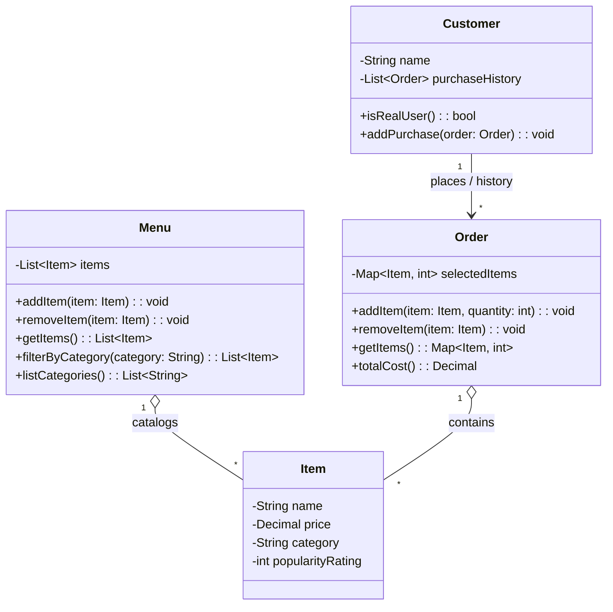

# ByteBites — Class Design

A UML-style class diagram for the ByteBites backend, covering the four core
classes: `Customer`, `Item`, `Menu`, and `Order`.

## Class diagram (Mermaid)

> Renders in most markdown previewers. If it doesn't render, see the ASCII
> version below.



## Class diagram (ASCII fallback)

```text
┌─────────────────────────┐         ┌──────────────────────────────┐
│        Customer         │         │           Menu               │
├─────────────────────────┤         ├──────────────────────────────┤
│ - name: String          │         │ - items: List<Item>          │
│ - purchaseHistory:      │         ├──────────────────────────────┤
│       List<Order>       │         │ + addItem(item: Item): void  │
├─────────────────────────┤         │ + removeItem(item: Item)     │
│ + isRealUser(): bool    │         │ + getItems(): List<Item>     │
│ + addPurchase(order)    │         │ + filterByCategory(cat)      │
└───────────┬─────────────┘         │ + listCategories(): List<Str>│
            │ 1                     └──────────────┬────────────────┘
            │ places                              │ 1
            │ *                                   │ catalogs
┌───────────▼─────────────────┐                  │ *
│          Order              │  *       ┌────────▼──────────────────┐
├─────────────────────────────┤ contains │          Item             │
│ - selectedItems:            │◆─────────│ - name: String            │
│       Map<Item, int>        │ 1      * │ - price: Decimal          │
├─────────────────────────────┤          │ - category: String        │
│ + addItem(item, qty): void  │          │ - popularityRating: int   │
│ + removeItem(item): void    │          └──────────────────────────┘
│ + getItems(): Map<Item,int> │
│ + totalCost(): Decimal      │
└─────────────────────────────┘
```

## Relationships

- **Customer → Order** (association): a customer places orders; past ones form
  their `purchaseHistory`.
- **Menu ◇→ Item** (aggregation): the menu catalogs many items, but items can
  exist independently of the menu.
- **Order ◇→ Item** (aggregation): an order contains the items the customer
  selected.

## Design Notes

- **Quantity tracking**: `Order.selectedItems` uses `Map<Item, int>` to track both items and their quantities. When adding/removing items, update counts accordingly.
- **Price handling**: `price` uses `Decimal` (not `float`) to avoid rounding errors in currency calculations.
- **Popularity rating**: Valid range is `[1, 5]` or `[1, 10]` — validate on assignment.
- **Menu categories**: Categories are free-form strings; `listCategories()` returns distinct values for UI filtering.
- **Customer verification**: `isRealUser()` should validate that `name` is non-empty and meets business rules (not used as a deletion flag).
